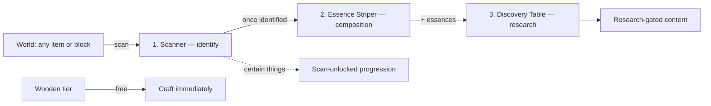
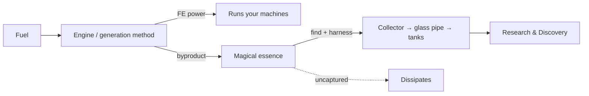

# Techromancy — Research, Discovery & Essence Design

> **Status:** living design doc · last updated 2026-08-09
> Captures the design discussed so far. Items marked _(decided)_ are settled; _(leaning)_ is a
> recommendation not yet confirmed; _(TBD)_ is open. Nothing here is built yet except the FE
> generators (see [Build order](#8-build-order)).

---

## 1. Vision

Techromancy fuses **steam-era technology** with **magic**. Progression is driven by **discovery**,
not by freely crafting up a tech tree. The connective idea:

> **Your machines are the wellspring of magic.** Running tech produces power *and* leaks magical
> essence — which you must learn to see and capture. Tech and magic share one language.

---

## 2. Progression & gating

- **Wooden tier is the free entry point** — craftable immediately, no research. _(decided)_
- **Everything above wooden tier is gated**, either **fully** (can't make/use until unlocked) or
  **partly** (works but limited, or only a partial recipe) until researched. _(decided)_
- Unlocks come from **three tiers of access**: _(decided)_

| Tier | How you get it | Example |
|---|---|---|
| **Free** | Craft immediately | Wooden Steam Engine |
| **Scan-unlocked** | Identify certain things with the Scanner — some progression opens right away | early upgrades |
| **Research-gated** | Full loop: identify → strip → research at the Discovery Table | Advanced / Mystic engines |

- Knowledge is tracked **per player** _(leaning — Thaumcraft-style)_.
- Each unlockable declares its own **requirement**, checked against player knowledge — e.g.
  `scanned:iron` (scan-unlocked) or `researched:steel` (research-gated). Something can be *partly*
  scan-unlocked and *fully* research-unlocked. _(decided — flexible requirement model)_

---

## 3. Research & Discovery loop

Knowledge is split into two questions, one per research block:

- **Scanner** → *"What is it?"* — identify/discover an item or block (required first step).
- **Essence Striper** → *"What's it made of?"* — reveal its essence composition (gated behind identify).
- **Discovery Table** → spend accumulated knowledge to **unlock** above-wooden content.

Essence is obtainable **two ways**: strip an item (Essence Striper) **or** capture machine byproduct
(see §5).

---

## 4. Essences

### 4a. Dual-reading _(decided)_
Each essence is **one concept with two faces** — a mechanical face and a mystical face. The same
essence is produced by tech and by magic, so scanning a boiler and scanning a flame spirit both
yield **Heat**. This is what ties the two halves of the mod together at the root.

### 4b. Structure: primals → compounds _(leaning)_
A small set of **primal** essences **combine into compounds**. Deducing combinations
("Metal + Motion = Machine") is itself gameplay, and it keeps the set extensible.

### 4c. Draft primal set _(TBD — names & count not final)_

| Primal | Tech face | Magic face |
|---|---|---|
| **Heat** (Ignus?) | combustion, steam, forge | elemental fire |
| **Motion** (Motus?) | gears, pistons, kinetic energy | force / kinetic magic |
| **Metal** (Metallum?) | alloys, machine frames | bound / structured matter |
| **Vapor** (Vapor?) | pressure, gas, steam | breath, spirit |
| **Mana** (Arcanum?) | stored charge / energy | raw magic |
| **Life** (Anima?) | organics, fuel, growth | soul / the "-mancy" side |

Naming vibe (Latin-ish vs plain English vs coined) is **TBD**. Count is **~6 leaning**, may grow.

### 4d. Example compounds & item decompositions _(illustrative)_

- Steel Gear → **Metal + Motion**
- Wooden Steam Engine → **Motion + Vapor + Life** (wood)
- **Imbued** Gear → **Metal + Motion + Mana** ← tech + magic = the mod's signature
- Solidified Mana → **Mana** (+ Order to make it solid)
- Mystic Steam Engine → **Heat + Vapor + Mana**

Pattern: *"imbued / mystic" = a tech thing that also carries **Mana**.*

### 4e. Essences must cover ANY item/block _(decided)_

Essences apply to **every** item/block in the game — vanilla, this mod, **and other mods** — not just
Techromancy content. Assignment is therefore a **layered resolver** (`item/block → essences`), never a
hand-authored per-item table, so unknown modded items are still covered automatically:

1. **Explicit assignments** — data-driven JSON (built-in defaults + datapack overrides) for primitives/roots. _highest priority_
2. **Tag-based defaults** — assign by common tags (`c:ingots/iron`, `minecraft:logs`, `c:gears`, …); most modded items follow tag conventions and get essences for free.
3. **Recipe derivation** — otherwise, sum the essences of the item's recipe ingredients (auto-covers any modded item with a recipe). _(the most complex layer)_
4. **Fallback** — a small default so nothing is ever essence-less. _lowest priority_

Resolution is lazy + cached, server-side (needs recipe manager + tags). Build the resolver with
**pluggable layers**: ship **explicit + tag + fallback** first (universality guaranteed from day one),
add **recipe derivation** as a drop-in layer later. The scan/identify side is already mod-agnostic (it
keys off raw registry-id strings).

---

## 5. Essence as a tech byproduct (the fusion mechanic)

Running machines have **two outputs**: FE power (see issue #3) **and** magical essence emitted as a
byproduct. The player must **find** it (notice what a machine is leaking) and **harness** it (capture
it) — or it's lost.

- **Find** ties to the **Scanner** — you can't harness what you haven't learned to see. _(leaning)_
- **Harness** = a **collector** block → **Pressurized Glass Pipe** (carries essence-vapor) →
  **essence tanks**. Gives the glass pipe a real job. _(leaning; alt: simple internal buffer you
  pull from)_
- **Uncaptured essence dissipates** — this is the incentive to build capture infrastructure.
  _(leaning — yes)_

### 5a. Emission is a PROFILE = f(fuel quality × engine/method) _(decided)_

The setup determines **both what kind** and **how much** essence leaks:

| Generation setup | Essence complexity | Amount |
|---|---|---|
| Wooden engine + basic fuel (wood, coal) | simple **primals** (Heat, Vapor) | low |
| Advanced engine + refined fuel | primals **+ simple compounds** (e.g. Pressure = Heat+Vapor) | moderate |
| Mystic engine + magical fuel | **complex compounds**, incl. **Mana/Arcanum** | high |

Consequences: higher-tier engines matter for *magic*, not just FE; and "what fuel in what engine" is
a real optimization. To get rare/complex essences for deep research, you need better engines + better
fuel — which are themselves research-gated. The loop closes on itself.

---

## 6. Architecture notes (implementation-facing)

- **Team-based knowledge** _(decided)_ — knowledge lives on a **research team**, not a player, so it
  can be shared. A solo player is a team of one (team id = their UUID); sharing merges two teams.
  Stored in world `SavedData` (Codec-based in 1.21.11) on the overworld; each team holds `identified`
  + `completedResearch` sets (+ `essence balances` later). Sharing is driven by
  `/techromancy research invite|accept|decline|leave|status`. Client sync is still TODO (needed for GUI).
- **Essence registry**: primals + compounds as registered objects (id, tech blurb, magic blurb,
  and for compounds, their recipe of primals).
- **Machine emission profiles**: each generation block + fuel maps to `{essences, complexity, rate}`.
- **Requirement model**: each gated recipe/block declares a requirement predicate over player
  knowledge (see §2).
- Reuses the 1.21.11 / Forge 61 patterns already established (BlockEntity, capabilities, energy) —
  see the codebase and prior notes.

---

## 7. Decisions log

**Decided:** Thaumcraft-style scan-to-learn north star · wooden free / above-wooden gated · three
access tiers (free / scan-unlocked / research-gated) · flexible per-unlockable requirement model ·
dual-reading essences · essence as a machine byproduct · emission profile = f(fuel × engine) driving
both complexity and amount · **team-based knowledge, shared via commands**.

**Leaning (confirm before building):** primals→compounds structure · uncaptured essence dissipates ·
capture via collector + glass pipe + tanks · Scanner needed to "find" byproduct.

**Open (TBD):** final essence list, count & naming vibe · essence storage details (tank capacity,
whether essence is fluid-like) · GUI designs (Scanner readout, Discovery Table research screen) ·
exactly which above-wooden things are scan-unlocked vs research-gated.

---

## 8. Build order

- **Phase 0 — DONE:** FE generators — all three steam engines (issue #3). _Not yet compiled on a real machine._
- **Phase 1 — IN PROGRESS:**
  - _done (uncompiled):_ research-entry registry (`research/`) · team-based knowledge store (`ResearchSavedData`, Codec `SavedData`) · sharing commands (`/techromancy research ...`).
  - _next:_ Scanner item that calls `identify(...)`, then wire one scan-unlock to a real recipe → smallest playable loop. Then client sync.
- **Phase 2:** Essence registry (primals) + Essence Striper reveals composition.
- **Phase 3:** Byproduct emission + capture (collector → pipe → tanks), using the emission profiles.
- **Phase 4:** Discovery Table research/unlock GUI.
- **Phase 5:** Compounds, fuller essence set, and gate the Advanced/Mystic engines behind research.
